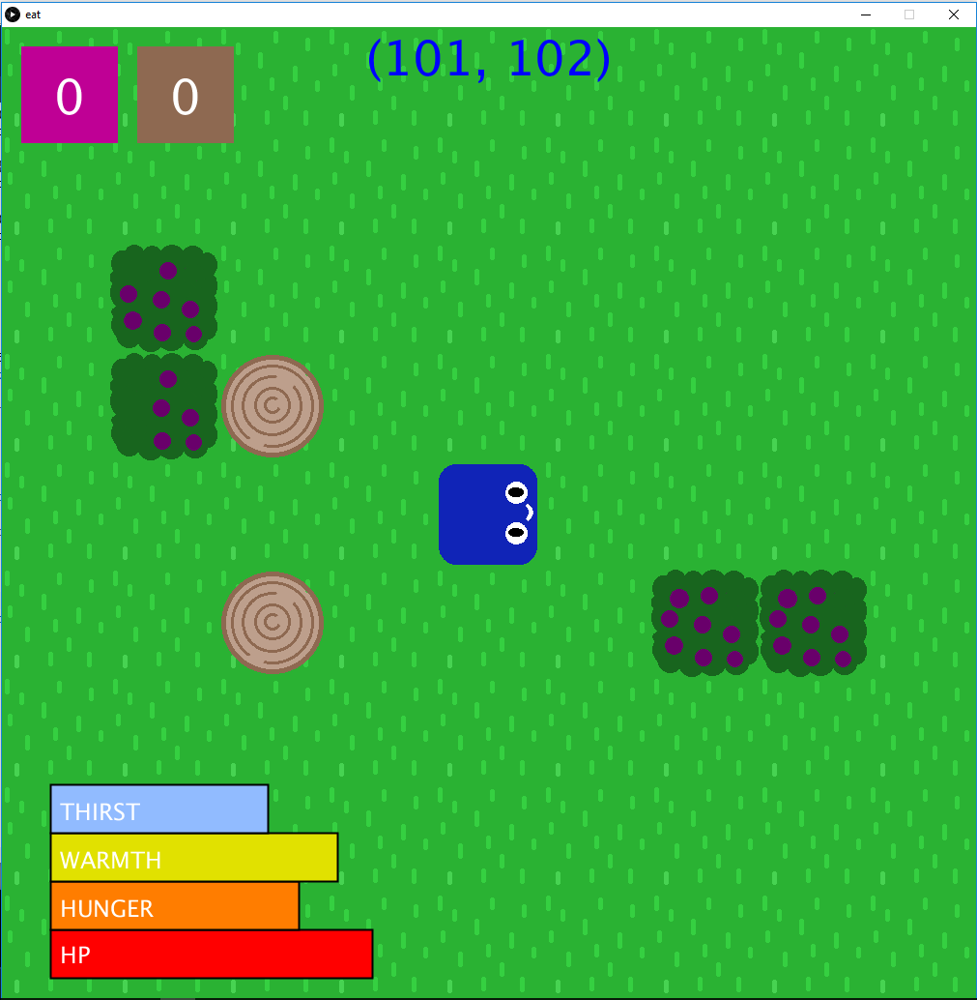

# Eat
A game where the player traverses around the map made of cells, harvests food from bushes, eats food, and stays alive.

# Controls
To traverse around the map, use the arrow keys.

To move the player's facing direction, use the WASD keys.

To pick berries/mine wood, press the space bar.

To consume berries, press the 'c' key.

To craft fire, press the 'f' key. The fire will automatically appear in the cell you are facing.

To use fire, and indulge in it's warmth, press the 'v' key.

# Notes/Bugs
Please note that once you stamp on fire, it will go out. IT'S NOT A BUG, IT'S A FEATURE

The HP bar continues beyond 0, and this will be fixed in the next two commits.

There is no "score" or "end of game" yet. This will be fixed in the next four commits.

Sometimes, the game and display will load, but your controls will fail to work. I don't know if something is wrong with my code, or if it is Processing itself.

Some parts of this game make use of Processing 3's new features, so it may not work on Processing 2.